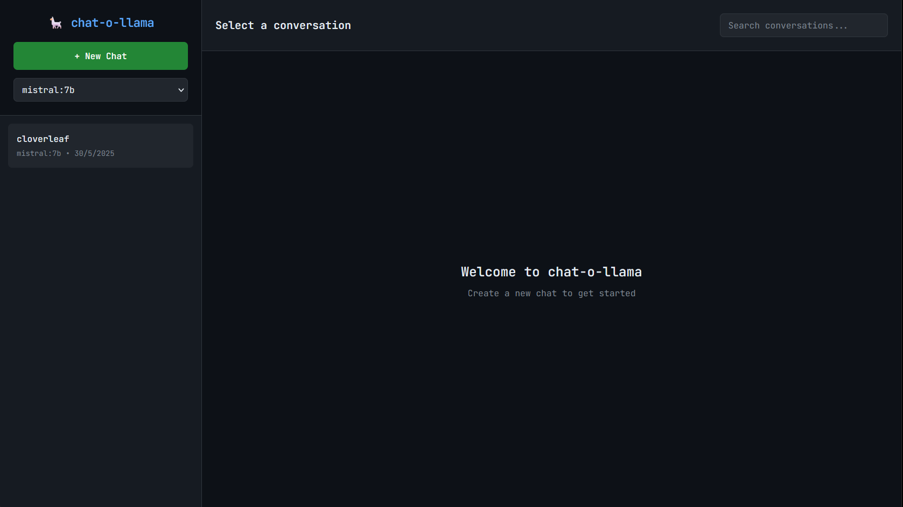

# Ollama Chat Frontend

A lightweight web interface for [Ollama](https://ollama.ai/) with persistent chat history and conversation management. Perfect for local AI development and experimentation.

  

## ✨ Features

- 💬 **Multiple Conversations** - Create and manage separate chat sessions
- 📚 **Persistent History** - All conversations stored locally in SQLite database
- 🔍 **Search Functionality** - Find messages across all conversations
- 🤖 **Model Selection** - Choose from available Ollama models
- 📱 **Responsive Design** - Works on desktop and mobile devices
- 🚀 **Lightweight** - Minimal resource usage, perfect for local development
- 🎯 **Process Management** - Easy start/stop with background service management
- 📊 **Real-time Logging** - Monitor application status and performance
- 🛠️ **Enhanced Process Management** - Robust stop functionality with force-kill option
- 🎯 **Clean Architecture** - No automatic environment setup, full user control

## 🖼️ Screenshot



## 🚀 Quick Start

### Prerequisites

- Python 3.8 or higher
- [Ollama](https://ollama.ai/) installed and running
- At least one Ollama model downloaded

### Installation

1. **Clone the repository**

   ```bash
   git clone https://github.com/ukkit/chat-o-llama.git
   ```

2. **Set up virtual environment**

   ```bash
   python3 -m venv chat-o-llama
   cd chat-o-llama
   source bin/activate
   pip install -r requirements.txt
   ```

3. **Make the manager script executable**

   ```bash
   chmod +x chat-manager.sh
   ```

4. **Start the application**

   ```bash
   ./chat-manager.sh start
   ```

5. **Access the web interface**

   ```url
   http://localhost:3000
   ```

### Important Notes

- **Virtual environment must be activated** before using the manager script
- The script performs **zero automatic setup** - all environment management is manual
- **Enhanced stop functionality** - includes force-stop option for stubborn processes
- All setup (venv creation, dependency installation) is done manually for better control

## 📋 Usage

### Process Management

```bash
# IMPORTANT: Always activate virtual environment first
source bin/activate

# Start the application (default port 3000)
./chat-manager.sh start

# Start on custom port
./chat-manager.sh start 8080

# Check if running
./chat-manager.sh status

# Stop the application gracefully
./chat-manager.sh stop

# Force kill all processes (if normal stop doesn't work)
./chat-manager.sh force-stop

# Restart the application
./chat-manager.sh restart

# View live logs
./chat-manager.sh logs

# Show help
./chat-manager.sh help
```

### First Time Setup

1. **Start Ollama** (if not already running)

   ```bash
   ollama serve
   ```

2. **Download a lightweight model** (recommended for local development)

   ```bash
   ollama pull phi3:mini      # 3.8GB - Good balance
   ollama pull gemma2:2b      # 1.6GB - Small and fast
   ollama pull tinyllama      # 637MB - Ultra lightweight
   ```

3. **Set up the chat frontend**

   ```bash
   # Create and activate virtual environment
   python3 -m venv chat-o-llama
   cd chat-o-llama
   source bin/activate

   # Install dependencies
   pip install -r requirements.txt

   # Start the application
   ./chat-manager.sh start
   ```

4. **Create your first conversation**
   - Open http://localhost:3000
   - Click "New Chat"
   - Select your model
   - Start chatting!

## 🔧 Process Management Features

The management script provides robust process control:

- **Graceful Shutdown**: Normal stop attempts clean termination first
- **Force Kill**: `force-stop` command for stubborn processes
- **Multi-Method Cleanup**: Stops processes by PID, process name, and port usage
- **Orphan Detection**: Finds and reports any remaining processes
- **Port Conflict Resolution**: Identifies what's using ports and suggests solutions
- **Enhanced Logging**: Detailed status information and troubleshooting hints

## 🔧 Configuration

### Environment Variables

| Variable | Default | Description |
|----------|---------|-------------|
| `PORT` | `3000` | Web server port |
| `OLLAMA_API_URL` | `http://localhost:11434` | Ollama server URL |
| `DATABASE_PATH` | `chat-o-llama.db` | SQLite database file path |
| `DEBUG` | `False` | Enable debug mode |

### Custom Configuration

```bash
# Use remote Ollama server
export OLLAMA_API_URL="http://192.168.1.100:11434"

# Custom database location
export DATABASE_PATH="/path/to/your/database.db"

# Start with environment variables
PORT=8080 ./chat-manager.sh start
```

## 📁 Project Structure

```
chat-o-llama/
├── README.md              # This file
├── chat-manager.sh         # Process manager script
├── app.py                 # Main Flask application
├── requirements.txt       # Python dependencies
├── templates/
│   └── index.html        # Web interface template
├── data/                 # Created automatically
│   └── chat-o-llama.db    # SQLite database
├── venv/                 # Virtual environment (create manually)
├── chat-o-llama.pid       # Process ID (when running)
└── chat-o-llama.log       # Application logs
```

## 🛠️ API Endpoints

The application provides a RESTful API for integration:

| Method | Endpoint | Description |
|--------|----------|-------------|
| GET | `/api/models` | Get available Ollama models |
| GET | `/api/conversations` | Get all conversations |
| POST | `/api/conversations` | Create new conversation |
| GET | `/api/conversations/{id}` | Get conversation with messages |
| DELETE | `/api/conversations/{id}` | Delete conversation |
| POST | `/api/chat` | Send message and get response |
| GET | `/api/search?q={query}` | Search conversations |

### API Usage Examples

```bash
# Get available models
curl http://localhost:3000/api/models

# Create new conversation
curl -X POST http://localhost:3000/api/conversations \
  -H "Content-Type: application/json" \
  -d '{"title": "My Chat", "model": "phi3:mini"}'

# Send a message
curl -X POST http://localhost:3000/api/chat \
  -H "Content-Type: application/json" \
  -d '{"conversation_id": 1, "message": "Hello!", "model": "phi3:mini"}'
```

## ⚡ Performance Optimization

### For Low-Resource Systems

If running on older hardware or limited resources:

1. **Use lightweight models**
   ```bash
   ollama pull tinyllama      # Fastest, 637MB
   ollama pull qwen2.5:1.5b   # Good balance, 1.5GB
   ```

2. **Optimize Ollama settings**
   ```bash
   export OLLAMA_NUM_PARALLEL=1
   export OLLAMA_MAX_LOADED_MODELS=1
   export OLLAMA_KEEP_ALIVE=5m
   ```

3. **Monitor resource usage**
   ```bash
   ./chat-manager.sh logs    # Check application logs
   htop                     # Monitor system resources
   ```

### Database Optimization

The SQLite database includes optimized indexes for fast searching:

```sql
-- Automatic indexes created
CREATE INDEX idx_messages_conversation ON messages(conversation_id);
CREATE INDEX idx_conversations_updated ON conversations(updated_at DESC);
```

## 🔍 Troubleshooting

### Common Issues

| Issue | Solution |
|-------|----------|
| Port already in use | Use `./chat-manager.sh start 8080` to use different port |
| Virtual environment not activated | Run `source bin/activate` first |
| Process won't stop | Try `./chat-manager.sh force-stop` |
| Ollama not responding | Check if Ollama is running: `curl http://localhost:11434/api/tags` |
| No models available | Download models: `ollama pull phi3:mini` |
| Permission denied | Make script executable: `chmod +x chat-manager.sh` |
| Flask not found | Install requirements: `pip install flask requests` |
| Database locked | Stop the application: `./chat-manager.sh stop` |

### Debug Mode

```bash
# Activate virtual environment
source bin/activate

# Enable debug mode
export DEBUG=true
./chat-manager.sh start

# View detailed logs
./chat-manager.sh logs
```

### Reset Database

```bash
# Stop the application and activate venv
./chat-manager.sh stop
source bin/activate

# Remove database file
rm -f data/chat-o-llama.db

# Restart (will create new database)
./chat-manager.sh start
```

## 📊 Monitoring

### Check Application Status

```bash
# Activate venv first
source bin/activate

# Quick status check
./chat-manager.sh status

# Live log monitoring
./chat-manager.sh logs

# System resource usage
htop
```

### Log Files

- `chat-o-llama.log` - Application logs and errors
- Access logs are included in the main log file
- Logs rotate automatically to prevent disk space issues

## 🤝 Contributing

Contributions are welcome! Please feel free to submit a Pull Request.

### Development Setup

1. Fork the repository
2. Set up development environment:
   ```bash
   python3 -m venv chat-o-llama
   cd chat-o-llama
   source bin/activate
   pip install -r requirements.txt
   ```
3. Run in development mode: `DEBUG=true python app.py`
4. Make your changes
5. Test thoroughly:
   ```bash
   cd chat-o-llama
   source bin/activate
   ./chat-manager.sh start
   ```
6. Submit a pull request

## 📄 License

This project is licensed under the MIT License - see the [LICENSE](LICENSE) file for details.

## 🙏 Acknowledgments

- [Ollama](https://ollama.ai/) - For the amazing local AI platform
- [Flask](https://flask.palletsprojects.com/) - For the lightweight web framework
- The open-source AI community for inspiration and support

**Made with ❤️ for the AI community**

> ⭐ If you find this project helpful, please consider giving it a star on GitHub!