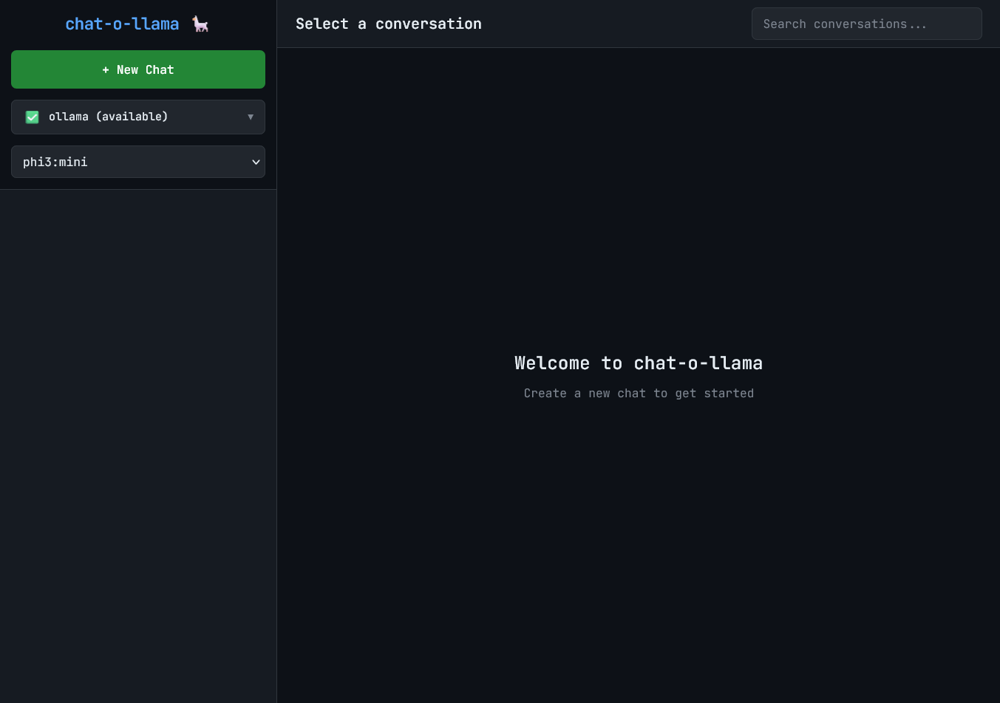
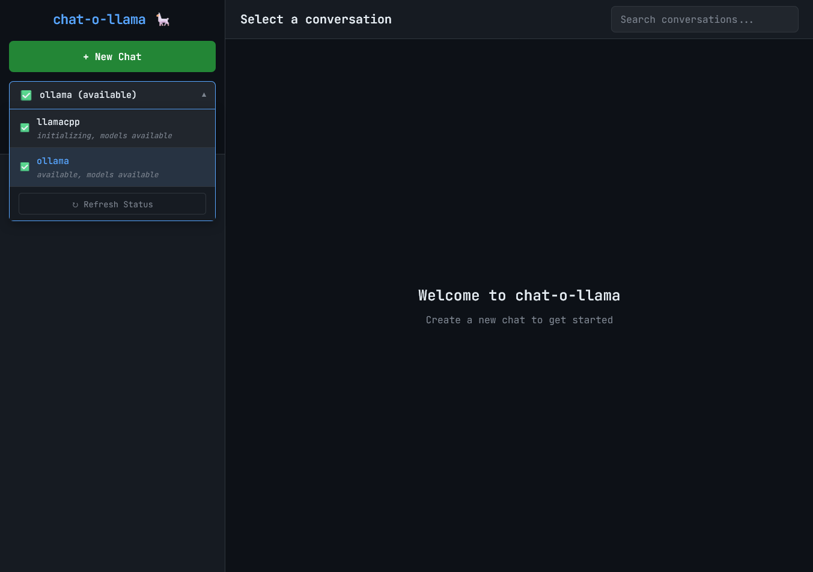
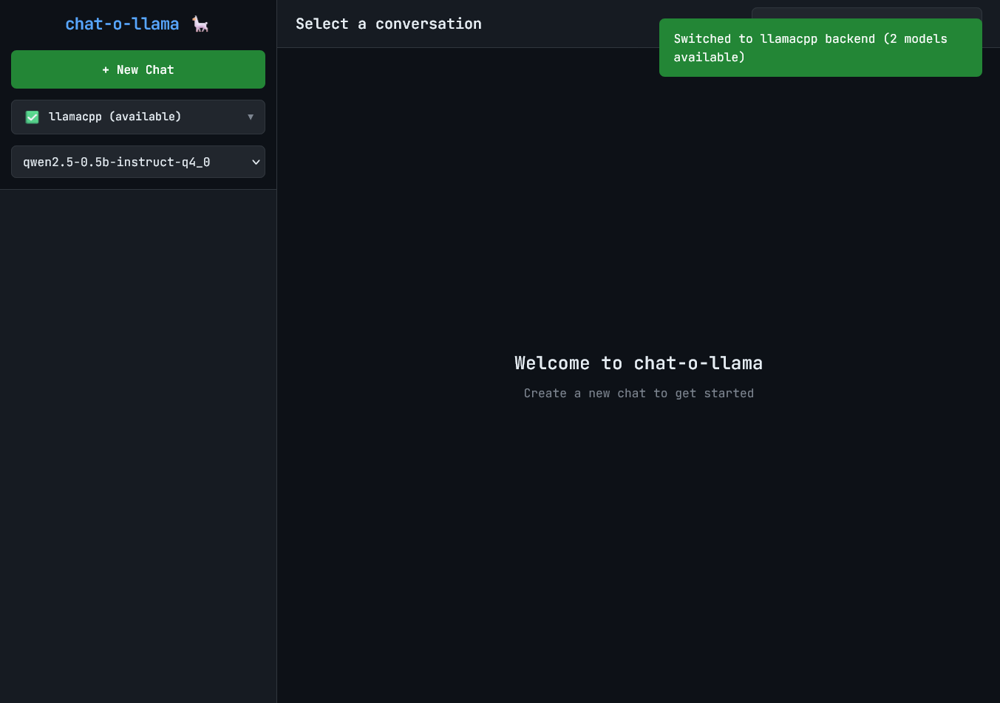
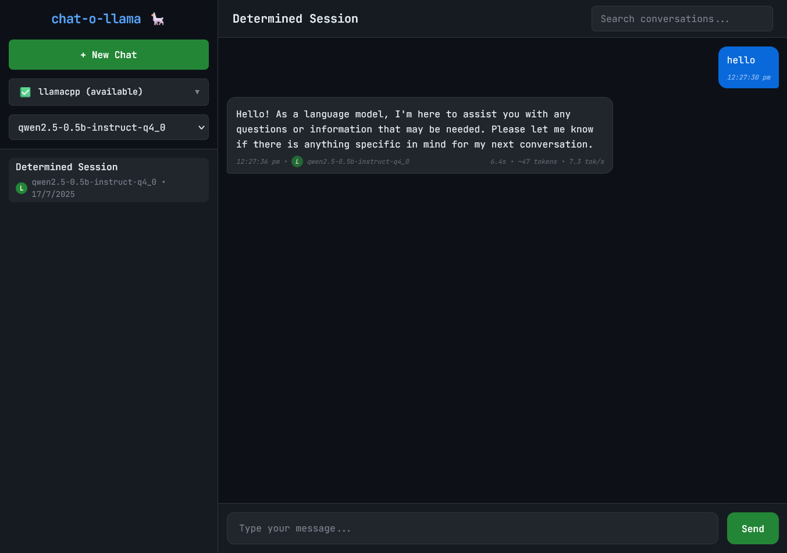
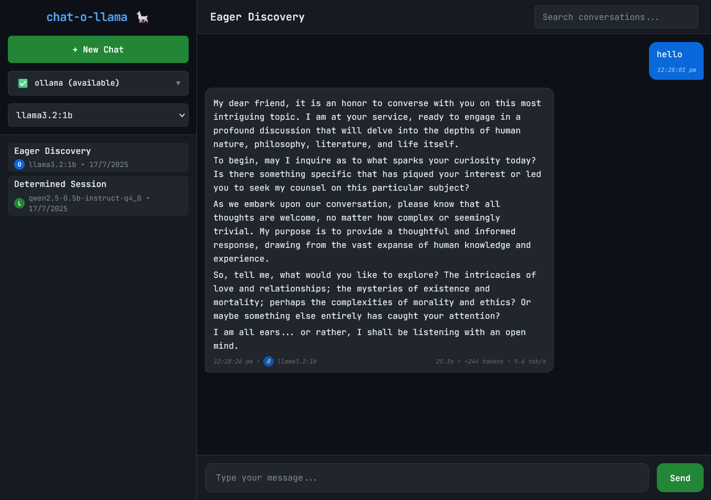
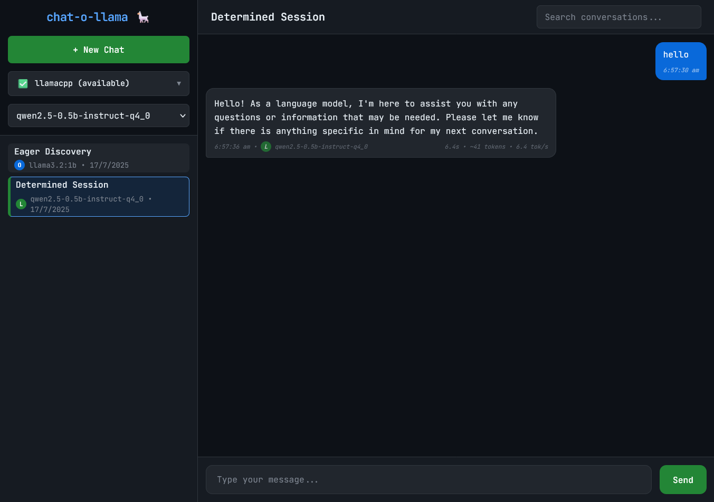

# ⚠️ This Repository is ARCHIVED

# Chat-O-Llama 🦙

### ⚡Best of Both Worlds: Now supporting Ollama AND Llama.cpp - switch backends on the fly!
---

A lightweight yet powerful web interface for Ollama and llama.cpp with markdown rendering, syntax highlighting, and intelligent conversation management.


[](https://buymeacoffee.com/ukkit)

## ⁉️ Why Another App?

Because **_why not_**? Having choices puts you in control.

## ✨ Features

- **Ollama Support** - Full integration with Ollama AI platform
- **llama.cpp Support** - Direct GGUF model support with high-performance inference
- **Multiple Conversations** - Create, manage, and rename chat sessions
- **Persistent History** - SQLite database storage with search functionality
- **Multi-Backend Support** - Automatic fallback between backends
- **Model Selection** - Choose from downloaded models across backends
- **Lightweight** - Minimal resource usage for local development
- **Full Markdown rendering** - GitHub-flavored syntax support
- **Response metrics** - Time, tokens, and speed tracking

## 🚀 Quick Start

**Automatic installation (recommended):**

```bash
curl -fsSL https://github.com/ukkit/chat-o-llama/raw/main/install.sh | bash
```

This will:
- Install Python and uv if missing
- Install Ollama if not present
- Download and set up Chat-O-Llama
- Start the service at http://localhost:3113

**Manual installation:**

```bash
git clone https://github.com/ukkit/chat-o-llama.git
cd chat-o-llama

# Using uv (recommended - faster and more reliable)
uv venv venv
source venv/bin/activate
uv sync

./chat-manager.sh start
```

*Installing llama.cpp*

```bash
curl -fsSL https://github.com/ukkit/chat-o-llama/raw/main/install-llamacpp.sh | bash
```
For detailed manual installation steps, see [install.md](./docs/install.md)

## 📸 Screenshots

<details> <summary><b>App Screenshots</b></summary>


First screen after installation


Available backends - Ollama and Llama.cpp


Quick switch between Ollama and Llama.cpp


Chat in llama.cpp with visible L indicator


Chat in Ollama with visible O indicator


Thinking styling

</details>

## 🆕 What's new in v2.1.0

- ✅ Collapsible Sidebar with Llama Icon
- ✅ Enhanced Chat Selection Identification
- ✅ Disable Chatbox for Unavailable Models
- ✅ Model Dropdown Validation Bug Fix

## 🔧 Troubleshooting

**Common issues:**

- Port in use? Run: `./chat-manager.sh start 3030`
- No models? Install one: `ollama pull tinyllama`
- Backend issues? Check status: `./chat-manager.sh backend status`

## 📚 Documentation

<details><summary>⚠️ Documentation updates in progress </summary>

| Document | Description |
|---------|-------------|
| [Installation Guide](./docs/install.md) | Detailed installation instructions |
| [Features](./docs/features.md) | Complete features overview |
| [Process Management](./docs/chat_manager_docs.md) | Using chat-manager.sh for service control |
| [Configuration](./docs/config.md) | Configuration options and settings |
| [API Reference](./docs/api.md) | REST API documentation |
| [Troubleshooting](./docs/troubleshooting.md) | Common issues and solutions |

</details>

## 🖥  Tested Hardware

| Device | CPU | RAM | OS |
|---------|-------------|---------|-------------|
| Raspberry Pi 4 Model B Rev 1.4 | ARM Cortex-A72 | 8GB | Raspberry Pi OS |
| Dell Optiplex 3070 | i3-9100T | 8GB | Debian 12 |
| Nokia Purebook X14 | i5-10210U | 16 GB | Windows 11 Home |

## 🐛 Known Issues

_Quiet a few known issues we are working on._

---

If you find this project helpful, consider:

- 🌟 Starring the repository on GitHub
- 🤝 [Supporting development](https://buymeacoffee.com/ukkit)
- 🐛 Reporting bugs and suggesting features

## License

MIT License - see [LICENSE](LICENSE) file for details.
