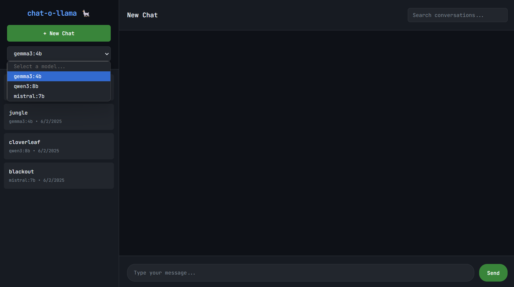
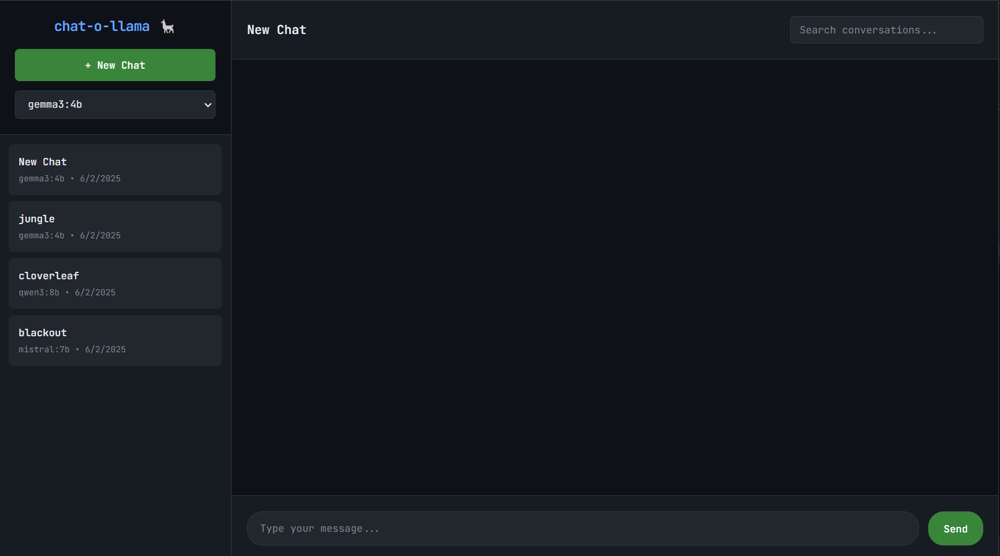
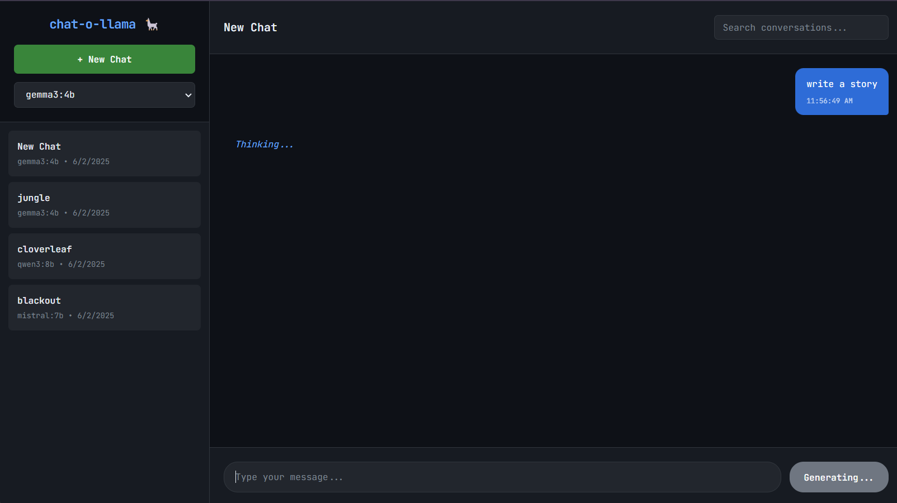

# chat-o-llama 🦙

A lightweight web interface for [Ollama](https://ollama.ai/) with persistent chat history, conversation management, and advanced configuration options.

  

## ✨ Features

- 💬 **Multiple Conversations** - Create, manage, and rename chat sessions
- 📚 **Persistent History** - SQLite database storage with search functionality
- 🤖 **Model Selection** - Choose from downloaded Ollama models
- ⚙️ **Advanced Configuration** - JSON-based configuration with performance optimization
- 📱 **Responsive Design** - Works on desktop and mobile
- 🚀 **Lightweight** - Minimal resource usage for local development
- 🎯 **Process Management** - Easy start/stop with background service management

<details>

<summary><b>📸 View Screenshots</b></summary>


select Model from drop-down


Started a new chat


waiting for response from ollama
</details>

## 🚀 Quick Start

### 🎯 Automatic Installation (Recommended)

**One-command installation with all dependencies:**

```bash
curl -fsSL https://github.com/ukkit/chat-o-llama/raw/main/install.sh | sh
```

**Alternative with wget:**

```bash
wget -O- https://github.com/ukkit/chat-o-llama/raw/main/install.sh | sh
```

The automatic installer will:
- ✅ Check and install Python 3.8+ and Ollama
- ✅ Download chat-o-llama from GitHub
- ✅ Set up virtual environment and dependencies
- ✅ Download recommended Ollama model (qwen2.5:0.5b ~380MB)
- ✅ Start the application automatically
- ✅ Provide access URL and management commands

**Access your chat interface at:** `http://localhost:3000`

### 📋 Manual Installation

For detailed manual installation steps, see **[install.md](./docs/install.md)**

**Quick manual setup:**

```bash
# Prerequisites: Python 3.8+, Ollama with at least one model
git clone https://github.com/ukkit/chat-o-llama.git
cd chat-o-llama
python3 -m venv venv
source venv/bin/activate
pip install -r requirements.txt
chmod +x chat-manager.sh
./chat-manager.sh start
```

## 📋 Usage

**⚠️ Important: Always activate virtual environment first: `source venv/bin/activate`**

### Process Management

```bash
./chat-manager.sh start [port]    # Start (default port 3000)
./chat-manager.sh status          # Check status
./chat-manager.sh stop           # Stop gracefully
./chat-manager.sh force-stop     # Force kill
./chat-manager.sh restart        # Restart
./chat-manager.sh logs           # View logs
./chat-manager.sh help           # Show help
```

## 🔧 Configuration

### JSON Configuration File

Chat-o-llama supports advanced configuration through a `config.json` file. The application will automatically create a default configuration or load your custom settings.

#### Quick Performance Setup

The default `config.json` is precision optimized for CPU-only systems, for detailed documentation see **[config.md](./docs/config.md)**

```json
{
  "timeouts": {
    "ollama_timeout": 600,
    "ollama_connect_timeout": 45
  },
  "model_options": {
    "temperature": 0.1,
    "num_predict": 4096,
    "num_ctx": 8192
  },
  "performance": {
    "context_history_limit": 15,
    "num_thread": -1,
    "num_gpu": 0
  },
  "system_prompt": "You are Dost, a knowledgeable and thoughtful AI assistant..."
}
```

#### Configuration API

Access current configuration via API:

```bash
curl http://localhost:3000/api/config
```

### Environment Variables

| Variable | Default | Description |
|----------|---------|-------------|
| `PORT` | `3000` | Web server port |
| `OLLAMA_API_URL` | `http://localhost:11434` | Ollama server URL |
| `DATABASE_PATH` | `chat-o-llama.db` | SQLite database path |
| `DEBUG` | `False` | Debug mode |

### Custom Configuration

```bash
# Use different port or remote Ollama
PORT=8080 ./chat-manager.sh start
export OLLAMA_API_URL="http://192.168.1.100:11434"
```

## ⚡ Performance Optimization

### For CPU-Only Systems (Recommended)

The default `config.json` is performance optimized for CPU-only systems like the Dell Optiplex series.

For faster response, you can use `speed_config.json` file:

**Key Optimizations:**
- **Faster Sampling**: Uses `min_p` + `typical_p` instead of `top_p`/`top_k` for 10-20% speed improvement
- **Reduced Context**: `num_ctx: 2048` and `num_predict: 1024` for faster responses
- **CPU Optimization**: `low_vram: true`, `num_batch: 2` for better multi-core utilization
- **Memory Efficient**: `context_history_limit: 5` for faster processing

### For GPU Systems

Modify `config.json` for GPU acceleration:
```json
{
  "performance": {
    "num_gpu": 1,
    "main_gpu": 0,
    "low_vram": false
  },
  "model_options": {
    "num_ctx": 4096,
    "num_predict": 2048
  }
}
```

## 🛠️ API Endpoints

Refer to api documentation for details **[api.md](./docs/api.md)**

| Method | Endpoint | Description |
|--------|----------|-------------|
| GET | `/api/models` | Available models |
| GET | `/api/config` | Current configuration |
| GET/POST | `/api/conversations` | List/create conversations |
| GET/DELETE | `/api/conversations/{id}` | Get/delete conversation |
| POST | `/api/chat` | Send message |
| GET | `/api/search?q={query}` | Search conversations |

## 🔍 Troubleshooting

For detailed troubleshooting steps, see **[troubleshooting.md](./docs/troubleshooting.md)**

**Quick fixes for common issues:**

| Issue | Quick Fix |
|-------|-----------|
| Port in use | `./chat-manager.sh start 8080` |
| Process won't stop | `./chat-manager.sh force-stop` |
| Ollama not responding | `ollama serve` then restart app |
| No models | `ollama pull qwen2.5:0.5b` |
| Permission denied | `chmod +x chat-manager.sh` |
| Dependencies missing | `source venv/bin/activate && pip install -r requirements.txt` |

**Emergency reset:**

```bash
./chat-manager.sh force-stop
rm -rf venv && python3 -m venv venv
source venv/bin/activate && pip install -r requirements.txt
./chat-manager.sh start
```

## 📁 Project Structure

```
chat-o-llama/
├── install.sh                 # Auto installer script
├── chat-manager.sh             # Process manager
├── app.py                      # Flask application
├── config.json                 # Default Configuration file
├── speed_config.json           # Configuration file for speed over precision
├── requirements.txt            # Dependencies
├── templates/index.html        # Web interface
├── INSTALL.md                  # Detailed installation guide
├── docs/configuration.md       # Ollama configuration variables
├── docs/config_comparison.md   # Comparison of different ollama configurations
├── data/                       # Database (auto-created)
└── logs/                       # Logs directory (auto created)
```

## 🔄 Updates

### Automatic Update

```bash
cd ~/chat-o-llama
git pull origin main
source venv/bin/activate
pip install -r requirements.txt
./chat-manager.sh restart
```

### Reinstall with Auto-Installer

```bash
curl -fsSL https://github.com/ukkit/chat-o-llama/raw/main/install.sh | sh
# Choose option 1 to remove and reinstall
```

MIT License - see [LICENSE](LICENSE) file.

## 🙏 Acknowledgments

- [Ollama](https://ollama.ai/) - Local AI platform
- [Flask](https://flask.palletsprojects.com/) - Web framework

**Made with ❤️ for the AI community**

> ⭐ Star this project if you find it helpful!