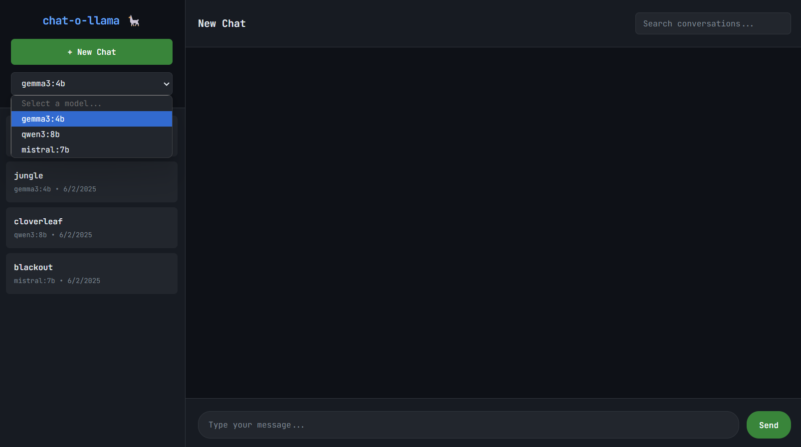
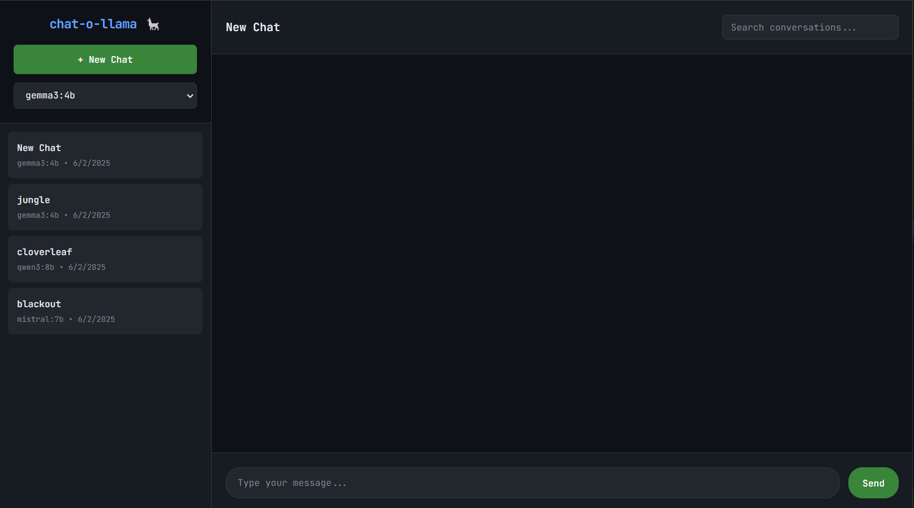
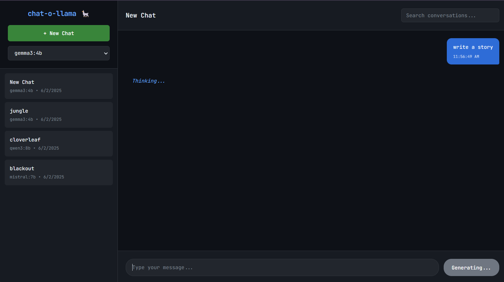

# chat-o-llama 🦙

A lightweight web interface for [Ollama](https://ollama.ai/) with persistent chat history and conversation management.

  

## ✨ Features

- 💬 **Multiple Conversations** - Create, manage, and rename chat sessions
- 📚 **Persistent History** - SQLite database storage with search functionality
- 🤖 **Model Selection** - Choose from available Ollama models
- 📱 **Responsive Design** - Works on desktop and mobile
- 🚀 **Lightweight** - Minimal resource usage for local development
- 🎯 **Process Management** - Easy start/stop with background service management



select Model from drop-down


Started a new chat


waiting for response from ollama

## 🚀 Quick Start

### Prerequisites

- Python 3.8+, [Ollama](https://ollama.ai/) installed with at least one model downloaded

### Installation & Setup

```bash
# Clone and setup
git clone https://github.com/ukkit/chat-o-llama.git
cd chat-o-llama
python3 -m venv chat-o-llama
source bin/activate
pip install -r requirements.txt
chmod +x chat-manager.sh

# Start the application
./chat-manager.sh start

# Access at http://localhost:3000
```

## 📋 Usage

**⚠️ Important: Always activate virtual environment first: `source bin/activate`**

### Process Management

```bash
./chat-manager.sh start [port]    # Start (default port 3000)
./chat-manager.sh status          # Check status
./chat-manager.sh stop           # Stop gracefully
./chat-manager.sh force-stop     # Force kill
./chat-manager.sh restart        # Restart
./chat-manager.sh logs           # View logs
./chat-manager.sh help           # Show help
```

### First Time Setup

```bash
# Start Ollama and download a model
ollama serve
ollama pull phi3:mini      # 3.8GB - recommended balance
ollama pull gemma2:2b      # 1.6GB - smaller option
ollama pull tinyllama      # 637MB - ultra lightweight
```

## 🔧 Configuration

### Environment Variables

| Variable | Default | Description |
|----------|---------|-------------|
| `PORT` | `3000` | Web server port |
| `OLLAMA_API_URL` | `http://localhost:11434` | Ollama server URL |
| `DATABASE_PATH` | `chat-o-llama.db` | SQLite database path |
| `DEBUG` | `False` | Debug mode |

### Custom Configuration

```bash
# Use different port or remote Ollama
PORT=8080 ./chat-manager.sh start
export OLLAMA_API_URL="http://192.168.1.100:11434"
```

## 🛠️ API Endpoints

| Method | Endpoint | Description |
|--------|----------|-------------|
| GET | `/api/models` | Available models |
| GET/POST | `/api/conversations` | List/create conversations |
| GET/DELETE | `/api/conversations/{id}` | Get/delete conversation |
| POST | `/api/chat` | Send message |
| GET | `/api/search?q={query}` | Search conversations |

## ⚡ Performance Tips

**For low-resource systems:**
- Use lightweight models: `tinyllama`, `qwen2.5:1.5b`
- Set Ollama environment variables:
  ```bash
  export OLLAMA_NUM_PARALLEL=1
  export OLLAMA_MAX_LOADED_MODELS=1
  export OLLAMA_KEEP_ALIVE=5m
  ```

## 🔍 Troubleshooting

| Issue | Solution |
|-------|----------|
| Port in use | `./chat-manager.sh start 8080` |
| Process won't stop | `./chat-manager.sh force-stop` |
| Ollama not responding | `curl http://localhost:11434/api/tags` |
| No models | `ollama pull phi3:mini` |
| Permission denied | `chmod +x chat-manager.sh` |
| Dependencies missing | `pip install -r requirements.txt` |

### Debug Mode

```bash
source bin/activate
DEBUG=true ./chat-manager.sh start
./chat-manager.sh logs
```

### Reset Database

```bash
./chat-manager.sh stop
rm -f data/chat-o-llama.db
./chat-manager.sh start
```

## 📁 Project Structure

```
chat-o-llama/
├── chat-manager.sh       # Process manager
├── app.py               # Flask application
├── requirements.txt     # Dependencies
├── templates/index.html # Web interface
├── data/               # Database (auto-created)
└── chat-o-llama.log    # Logs
```

## 🤝 Contributing

1. Fork the repository
2. Set up development environment with virtual environment
3. Run `DEBUG=true python app.py` for development
4. Test with `./chat-manager.sh start`
5. Submit pull request

## 📄 License

MIT License - see [LICENSE](LICENSE) file.

## 🙏 Acknowledgments

- [Ollama](https://ollama.ai/) - Local AI platform
- [Flask](https://flask.palletsprojects.com/) - Web framework

**Made with ❤️ for the AI community**

> ⭐ Star this project if you find it helpful!