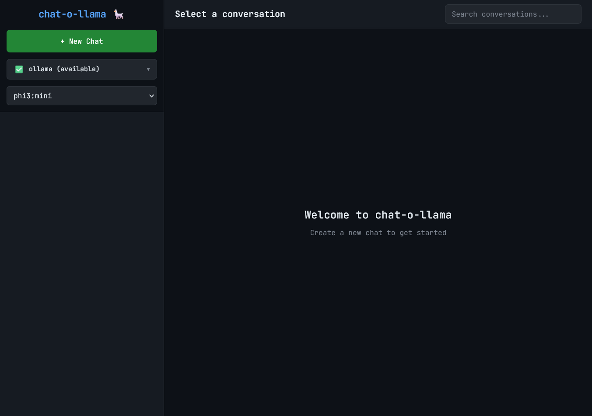
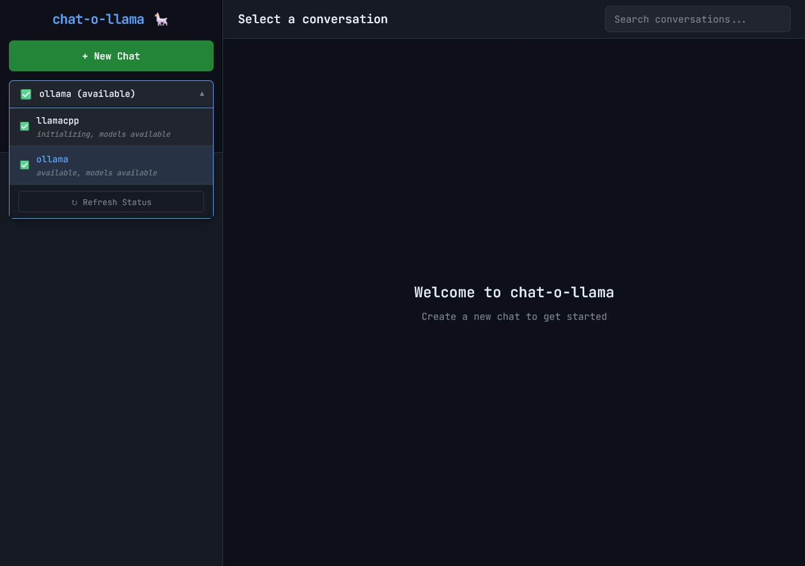
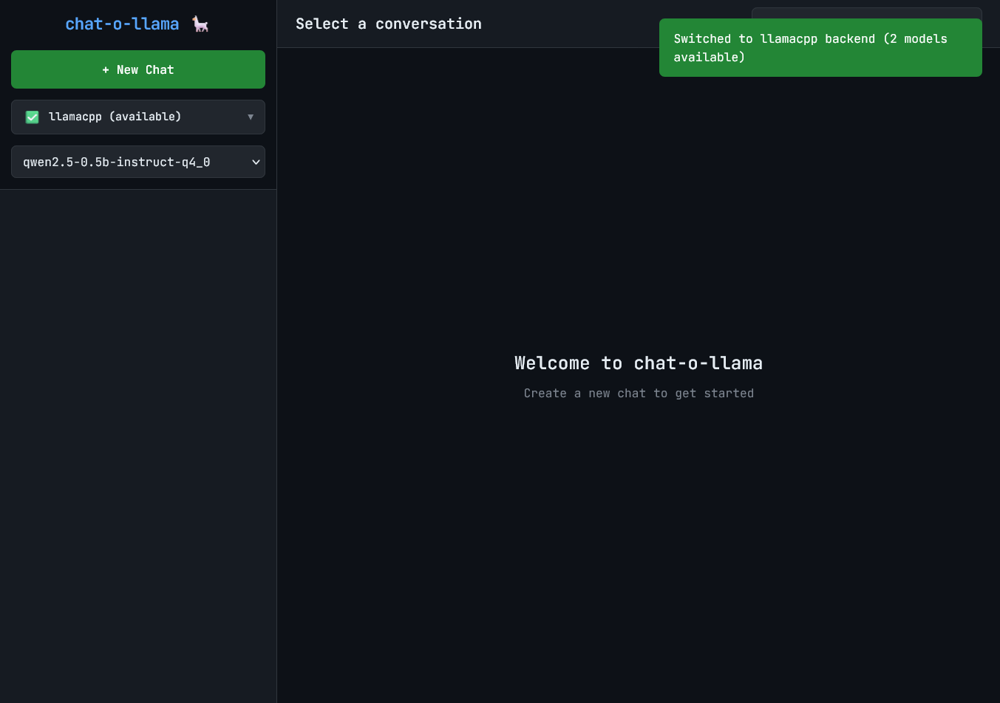
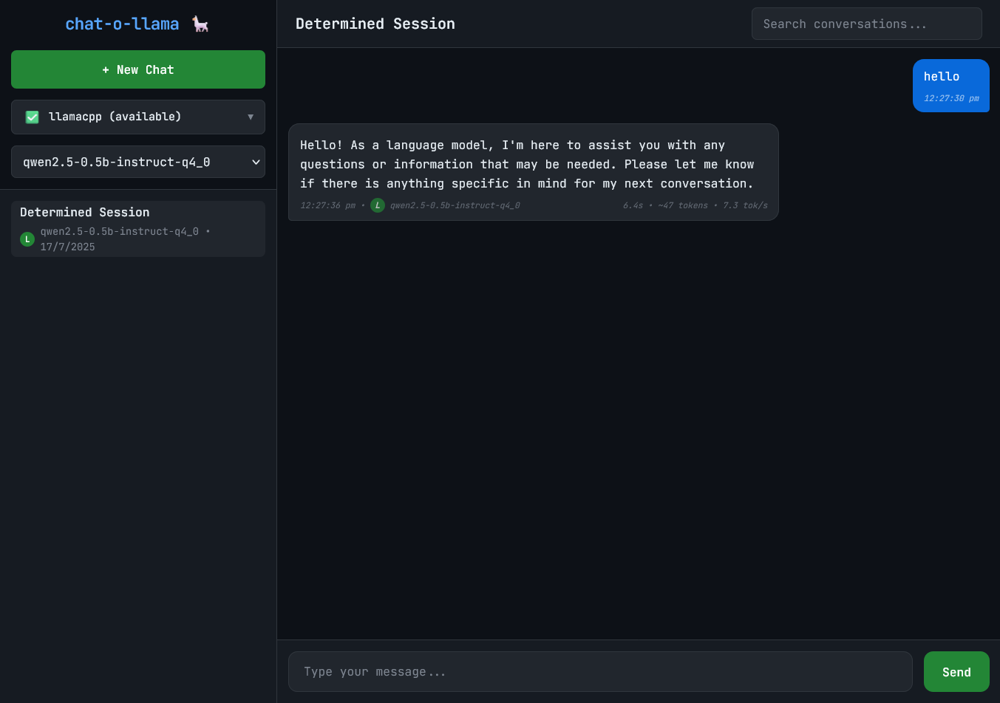
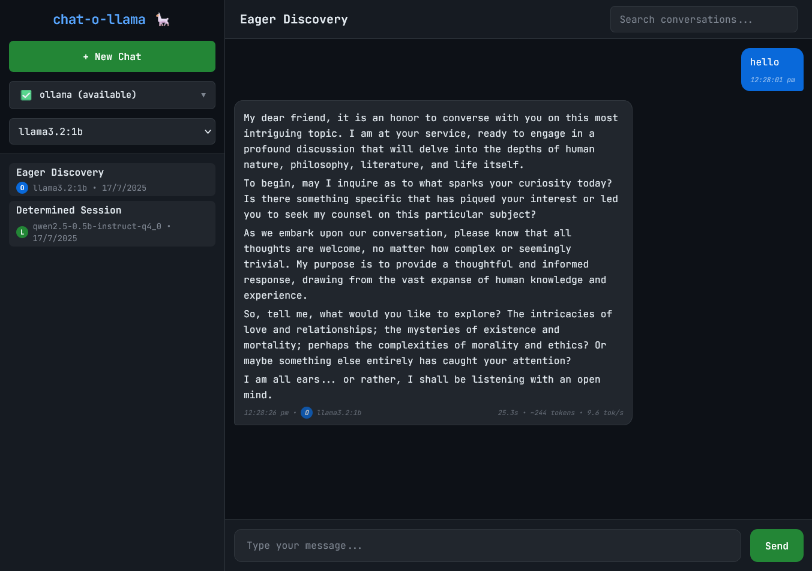
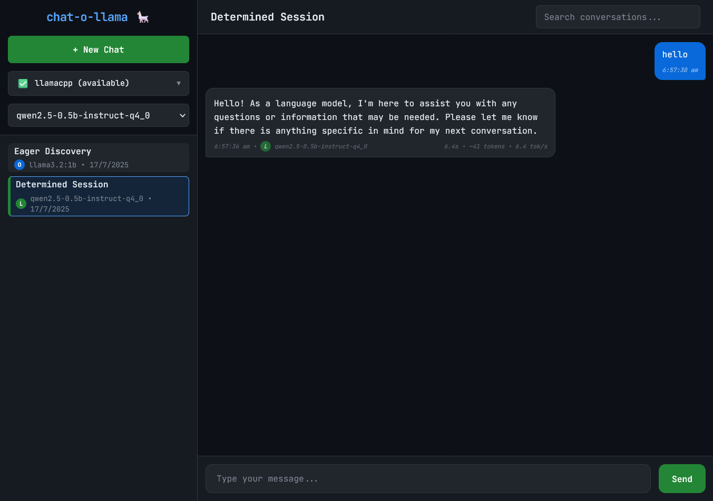

# Chat-O-Llama 🦙

### ⚡ Best of Both Worlds: Ollama AND Llama.cpp — switch backends on the fly!

---

A lightweight web interface for Ollama and llama.cpp with markdown rendering, syntax highlighting, intelligent context compression, and persistent conversation management. Designed to run on low-powered hardware.


[](https://buymeacoffee.com/ukkit)

## ⁉️ Why Another App?

Because **_why not_**? Having choices puts you in control.

## ✨ Features

- **Ollama + llama.cpp** — Switch backends on the fly; automatic fallback
- **Context Compression** — Compresses long conversations to fit model context windows (rolling window, intelligent summary)
- **Conversations** — Create, rename, search, and persist chat sessions in SQLite
- **Markdown + Metrics** — Rendered responses with token count, speed, and timing
- **Lightweight** — Runs on Raspberry Pi 4 with 8 GB RAM

## 🚀 Quick Start

**Automatic installation (recommended):**

```bash
curl -fsSL https://github.com/ukkit/chat-o-llama/raw/main/install.sh | bash
```

This will:
- Install Python and uv if missing
- Install Ollama if not present
- Download and set up Chat-O-Llama
- Start the service at http://localhost:3113

**Manual installation:**

```bash
git clone https://github.com/ukkit/chat-o-llama.git
cd chat-o-llama

# Activate the git hook for automatic versioning
git config core.hooksPath .githooks

# Using uv (recommended)
uv venv venv
source venv/bin/activate
uv sync

./chat-manager.sh start
```

*Installing llama.cpp:*

```bash
curl -fsSL https://github.com/ukkit/chat-o-llama/raw/main/install-llamacpp.sh | bash
```

For detailed steps, see [install.md](./docs/install.md).

## 📸 Screenshots

<details><summary><b>App Screenshots</b></summary>


First screen after installation


Available backends — Ollama and Llama.cpp


Quick switch between Ollama and Llama.cpp


Chat in llama.cpp with visible L indicator


Chat in Ollama with visible O indicator


Thinking styling

</details>

## 🆕 What's new

**2026.0609.1208**
- Startup time reduced from 10–40s to ~500ms — backend health checks deferred to first request
- Compression subsystem and DB tables only initialised when `compression.enabled = true`
- `MCPManager` reduced to one shared lazy instance; no longer created at import time
- highlight.js, marked.js, and github-dark CSS bundled locally — UI works fully offline
- Removed `psutil` (unused dependency)
- Context compression decoupled from message storage — `ConversationManager` returns raw messages only; compression is an explicit step via `build_chat_context()`
- `ContextCompressor` is now the single entry point for all compression operations
- Removed `mcp` from required dependencies (install separately if needed)
- Updated Flask, requests, and llama-cpp-python to current versions
- Domain glossary added (`CONTEXT.md`)

**2025.0718.0000** _(last semantic release: v2.1.0)_
- Collapsible sidebar with Llama icon
- Enhanced chat selection identification
- Disable chatbox for unavailable models
- Model dropdown validation bug fix

## 🔧 Troubleshooting

**Common issues:**

- Port in use? Run: `./chat-manager.sh start 3030`
- No models? Install one: `ollama pull tinyllama`
- Backend issues? Check status: `./chat-manager.sh backend status`

## 📚 Documentation

<details><summary>Documentation</summary>

| Document | Description |
|---------|-------------|
| [Installation Guide](./docs/install.md) | Detailed installation instructions |
| [Features](./docs/features.md) | Complete features overview |
| [Process Management](./docs/chat_manager_docs.md) | Using chat-manager.sh for service control |
| [Configuration](./docs/config.md) | Configuration options and settings |
| [API Reference](./docs/api.md) | REST API documentation |
| [Troubleshooting](./docs/troubleshooting.md) | Common issues and solutions |

</details>

## 🖥 Tested Hardware

| Device | CPU | RAM | OS |
|---------|-------------|---------|-------------|
| Raspberry Pi 4 Model B Rev 1.4 | ARM Cortex-A72 | 8GB | Raspberry Pi OS |
| Dell Optiplex 3070 | i3-9100T | 8GB | Debian 12 |
| Nokia Purebook X14 | i5-10210U | 16GB | Windows 11 Home |

## 🐛 Known Issues

_Quite a few known issues we are working on._

---

If you find this project helpful, consider:

- 🌟 Starring the repository on GitHub
- 🤝 [Supporting development](https://buymeacoffee.com/ukkit)
- 🐛 Reporting bugs and suggesting features

## License

MIT License — see [LICENSE](LICENSE) for details.
